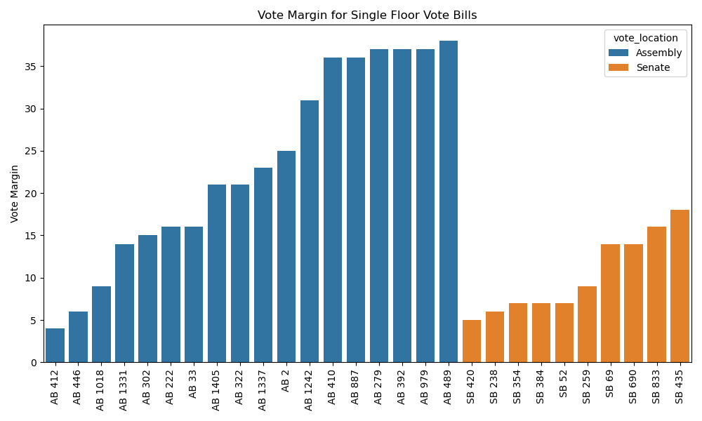
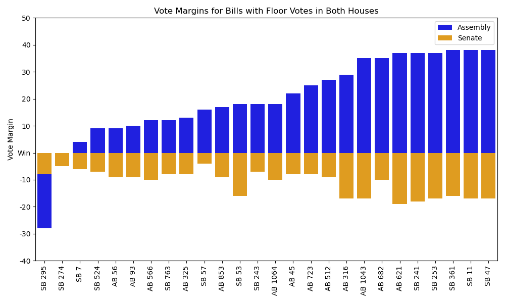

# California State AI Bills: 2025 Recap
We reviewed all the AI-related bills from the California legislature's 2025 session.

## Process

### Bill selection
Outside of this repository, we pulled all the bills from our [CA Legislation Tracker](https://github.com/techequitycollaborative/legislation-tracker) tool that had been categorized as an AI bill. We combined this list of bills with a previous list of AI bills that we had been tracking before the creation of the CA Legislation Tracker. We then manually reviewed this list to remove duplicates and verify for relevance. We removed bills that were not truly AI related but had been inaccurately labeled, as well as those that mentioned AI but did not contain substantive AI policies. We also corrected some topic labelling, and selected one primary topic per bill. This process resulted in 71 bills for analysis.

### Bill success
We then assign each bill a 'success status' based on their final bill status, as reported by California LegInfo. We assign the following success categories: 
- Signed: A bill was signed by the Governor and chaptered
- Vetoed: A bill made it to the Governor's desk but was vetoed
- Failed: A bill never made it to the Governor's desk

## Analysis

### Bill success overview
Of the 71 bills reviewed, 21 were signed, 7 were vetoed, and 43 failed to reach the Governor's desk.

### Bill success by topic
We break down bill success by bill topic. 

### Bill success by author
We also look at bill success by primary author (we do not analyze co-authors). There were 15 authors who authored at least 1 signed AI bill.

The authors with the highest number of AI bills signed were Bauer-Kahan (4), Arreguin (3), and Wicks (3).

### Floor vote margins
For bills that had one or two floor votes, we calculate the floor vote margin, i.e. the number of spare/extra votes a bill received beyond the 21 (Senate) and 41 (Assembly) needed to pass. Note: certain bills require two-thirds majority, i.e. 27 (Senate) and 54 (Assembly) votes to pass.

Looking at vote margins tells us how tight or contentious a floor vote was for a particular bill. Votes with a small vote margin narrowly passed, whereas votes with a large vote margin represent greater consensus among legislators.

We segment floor vote margin into two groups of bills: those that only had a floor vote in their house of origin, and those that had both a floor vote in their house of origin and in the opposite house.

For bills that only had a floor vote in their house of origin, see the spread of vote margins below. In this group, the average vote margin for Assembly bills was 23 and the average vote margin in the Senate was 10. 

For bills that had a floor vote in both their house of origin and the opposite house, see the spread of vote margins below. For Assembly bills in this group, the average Assembly floor vote was 22 and the average Senate floor vote was 11. For Senate bills in this group, the average Senate floor vote was 11 and the average Assembly floor vote was 18.

Note that SB 274's Assembly vote margin was zero, and SB 295's Assembly vote margin was negative, meaning it did not pass the Assembly floor.

