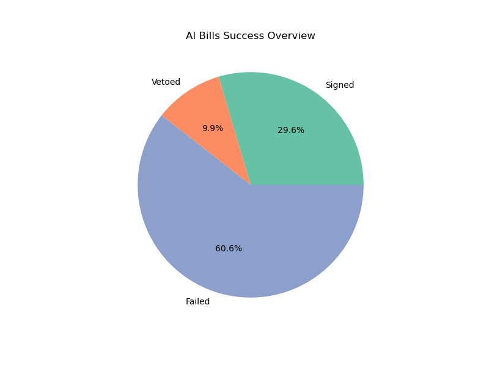
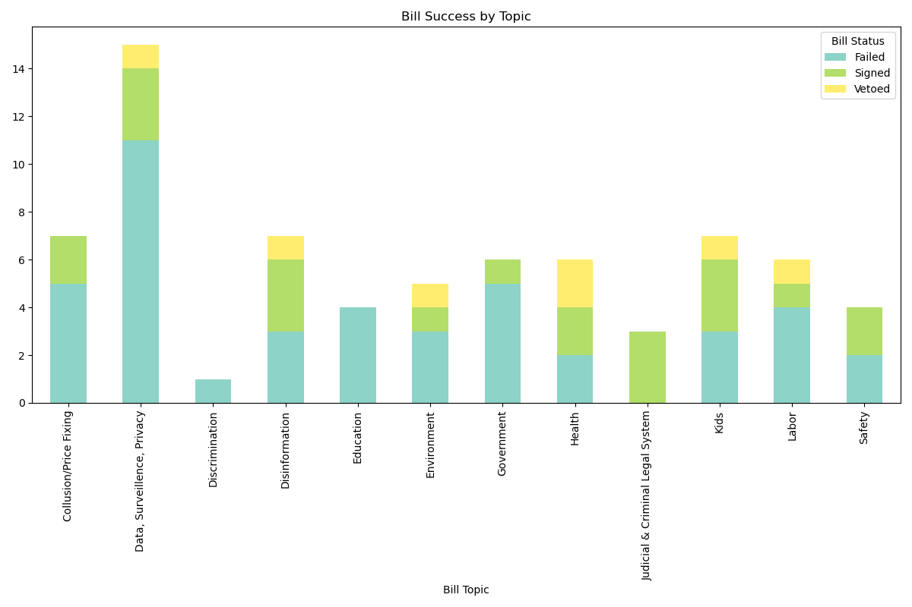
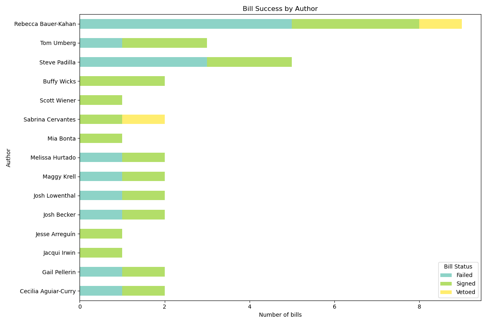

# California State AI Bills: 2025 Recap
We reviewed all the AI-related bills from the California legislature's 2025 session.

## Process

### Bill selection
Outside of this repository, we pulled all the bills from our [CA Legislation Tracker](https://github.com/techequitycollaborative/legislation-tracker) tool that had been categorized as an AI bill. We combined this list of bills with a previous list of AI bills that we had been tracking before the creation of the CA Legislation Tracker. We then manually reviewed this list to remove duplicates and verify for relevance. We removed bills that were not truly AI related but had been inaccurately labeled, as well as those that mentioned AI but did not contain substantive AI policies. We also corrected some topic labelling, and selected one primary topic per bill. This process resulted in 71 bills for analysis.

### Bill success
We then assign each bill a 'success status' based on their final bill status, as reported by California LegInfo. We assign the following success categories: 
- Signed: A bill was signed by the Governor and chaptered
- Vetoed: A bill made it to the Governor's desk but was vetoed
- Failed: A bill never made it to the Governor's desk

## Analysis

### Bill success overview
Of the 71 bills reviewed, 21 were signed, 7 were vetoed, and 43 failed to reach the Governor's desk.

### Bill success by topic
We break down bill success by bill topic. 

### Bill success by author
We also look at bill success by primary author (we do not analyze co-authors). There were 15 authors who authored at least 1 signed AI bill.

The authors with the highest number of AI bills signed were Bauer-Kahan (4), Arreguin (3), and Wicks (3).

